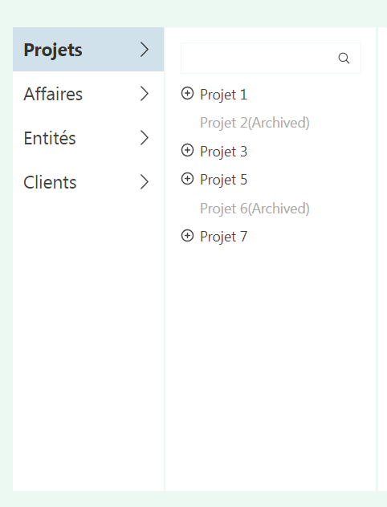
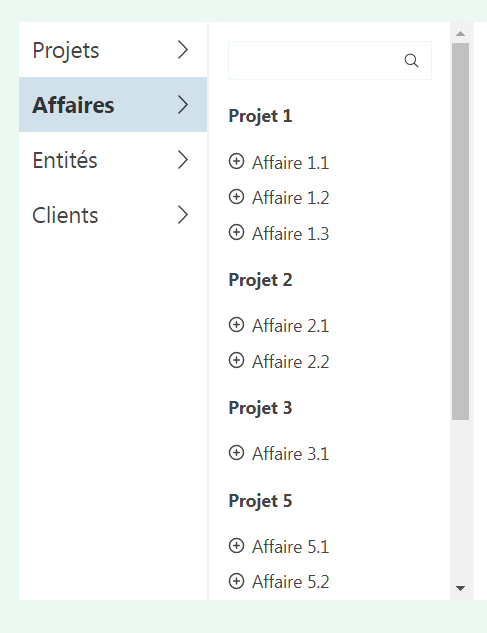
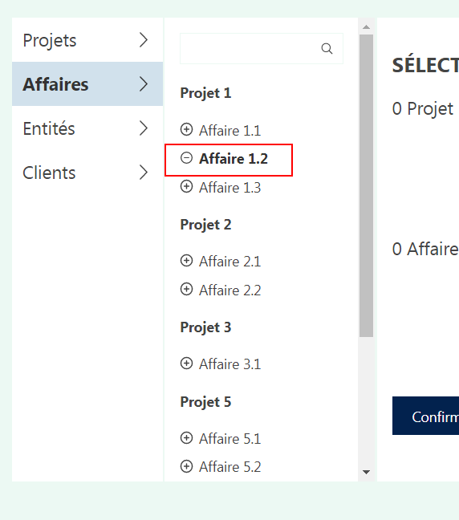
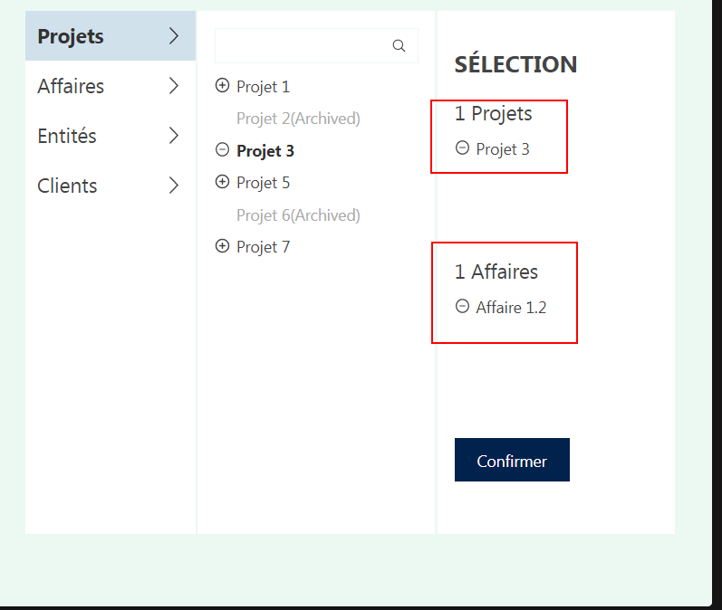
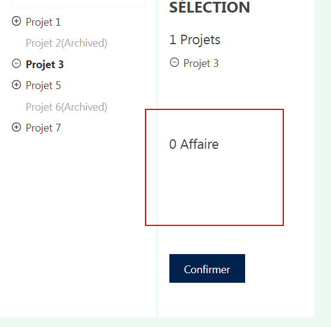
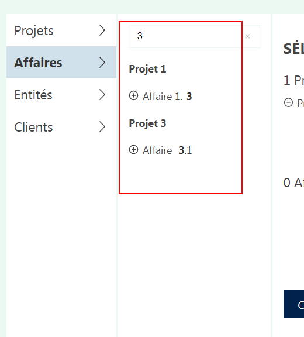

# L'exercice de Groupe ProjeX

Bonjour, madame ou Monsieur. Merci d'avoir consulté cette repo, tout d'abord, je vais vous expliquer la structure ce project.

Les fichers de logiciels sont réalisés par typescript, `.ts` ou `.tsx`, dans la répertoire `./src`. Vous pouvez exécuter les commands `npm run start`, `npm run test`, rappelez qu'il faut installer les dépandances à l'avant, donc je vous recommande d'installer les dépandances par `npm install`.

Je n'ai pas utilisé les autres libraires, sauf que `@testing-library/react` pour les tests unitaires. Tous composants sont en **React Hooks**, management de l'état est par `reducer + context`. Et le styling est par `SASS module`, les fichers comme `**.module.scss`, vous pouvez regarder dans la structure de la répertoire au-dessous.

Les demandes de ce test sont dans le ficher `./README_DEMANDES.md`.

## La répertoire

```bash
│── App.module.scss # styling
│── App.tsx # le root composant, pour initialiser le context, reducer et importer les donneés
│── custom.d.ts # pour rendre compatible les fichers de module scss
│── index.css # le ficher original
│── index.tsx # le ficher original
│── reducer.ts # le ficher de 'reducer', qui est nécessaire à 'useReducer'
│── typing.ts # pout stocker quelques types, enums
├───components
│     │── index.module.scss # le ficher de styling pour tous les composants
│     │── index.ts # rien de logiciel, juste pour exporter
│     │── LeftBar.tsx # la partie douche de l'interface, qui vous permets de changer entre 'Projets' et 'Affaires'
│     │── MiddleContent.tsx # la partie centre, qui vous montre tous les Projets' ou 'Affaires' et vous permets de changer falire les cherches
│     └── RightBar.tsx # la partie droite de l'interface, qui vous permets de confirmer tous les choses choisises
├───data
│     └── data.ts # le ficher original
├───icons # les SVG icons, rien de spécial
│     │── CircleMinus.tsx
│     │── CirclePlus.tsx
│     │── index.ts
│     │── RemoveIcon.tsx
│     │── RightIcon.tsx
│     └── Search.tsx
├───models
│     │── AffairModel.ts # le ficher original
│     └── ProjectModel.ts # le ficher original
├───tests
│     │── App.test.tsx # les tests unitaires pour le composant 'App', 'LeftBar' et 'RightBar'
│     │── MiddleContent.test.tsx # les tests unitaires pour le composant 'MiddleContent'
│     └── reducer.test.ts # les tests unitaires pour le reducer
└───utils
      └── index.ts # les fontions auxilliaires
```

## Les fonctions realisés

### Basculer entre 'Projets' et 'Affaires'




### Choisir les 'Projets' ou 'Affaires'



### Confirmer et Annuler quelques choses confirmées




### Recherche



## L'amélioration possibles

Pour la solution de managemet de l'état, ou peut utillser `redux + reselctor` ou les autres à améliorer la performance. `reducer + context` ne peut pas assurer la fiabilité qnand le projet s'agrondit.

Et pour les tests, `End2End` tests ne sont pas introduits. Dans ce cas, ce n'est pas grave. Mais quand il s'agit des demandes assez compliqués, par exemple beaucoup des ajax et beaucoup des operations de `localStroage` et quelques autres appelés de APIs des navigateirs, `End2End` tests sont inévitables.
